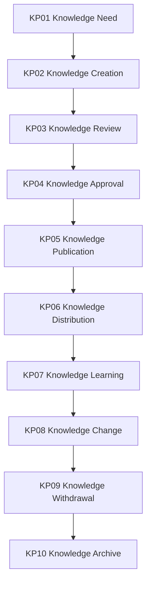

# Knowledge Lifecycle Control Framework

Version: 1.0  
Status: Proposed Baseline  
Architecture: Rimba Team Operating System


## Purpose

This document governs the complete Knowledge lifecycle within TOS while preserving existing Rimba package boundaries.

## Owning Implementation

```text
rimba/dms + rimba/lms
```

## Rimba Alignment

- Controlled knowledge: reuse the DMS `Document` aggregate and supporting review, approval, distribution, acknowledgement, attachment, signature, training and retention models.
- Learning delivery: reuse LMS Course, Module, Enrollment, Evaluation and Certificate models.
- Versioning: reuse polymorphic `Version`; do not create `Knowledge` or `KnowledgeVersion` solely as wrappers.
- `Document` is the controlled knowledge record, while attachments are representations.
- Team governance: use `TeamKnowledge`.

## Framework Hierarchy

```text
Lifecycle
  ↓
Lifecycle Package
  ↓
WorkflowBlueprint
  ↓
WorkflowNode
  ↓
WorkPackage
  ↓
Checklist
  ↓
Task
```

A lifecycle package is governance. Runtime orchestration remains in `rimba/jalan`, while executable work remains in `rimba/kerja`.

## Lifecycle Overview



## Lifecycle Packages

### KP01 Knowledge Need

**Input:** Identified knowledge gap  
**Output:** Approved knowledge need

### KP02 Knowledge Creation

**Input:** Approved knowledge need  
**Output:** Document draft

### KP03 Knowledge Review

**Input:** Document draft  
**Output:** DocumentReview

### KP04 Knowledge Approval

**Input:** Reviewed document  
**Output:** DocumentApproval

### KP05 Knowledge Publication

**Input:** Approved document/version  
**Output:** Released Document

### KP06 Knowledge Distribution

**Input:** Released Document  
**Output:** Distribution and acknowledgement evidence

### KP07 Knowledge Learning

**Input:** Released learning content  
**Output:** Enrollment, evaluation, or certificate evidence

### KP08 Knowledge Change

**Input:** Approved revision  
**Output:** New Version

### KP09 Knowledge Withdrawal

**Input:** Withdrawal decision  
**Output:** Obsolete Document

### KP10 Knowledge Archive

**Input:** Obsolete Document  
**Output:** Retention and archived record

## Governance Rules

1. Every Knowledge lifecycle workflow shall map to exactly one lifecycle package.
2. Existing package-owned models shall be reused rather than duplicated in `rimba/tos`.
3. Every lifecycle transition shall preserve status, effective date, actor, source and evidence where applicable.
4. Version history shall use `rimba/versi` when content versioning is required.
5. Flexible metadata shall use the established `attributes` strategy or `rimba/sifat`.
6. Audit evidence shall use package events and `rimba/jejak`.
7. Team relationships shall be explicit when ownership, operation, allocation or audience can change over time.
8. Retirement shall close active relationships and stop new activity; it shall not erase history.
9. Cross-domain triggers shall reference the originating model through explicit keys or polymorphic triggerable relationships.
10. No implementation shall begin without an approved lifecycle package mapping.

## TOS Relationship

```text
Resource performs Workflow
Workflow delivers Offering
Supply enables Workflow
Knowledge guides Workflow
OrgTeam governs the relationships
```

## End of Control Framework
