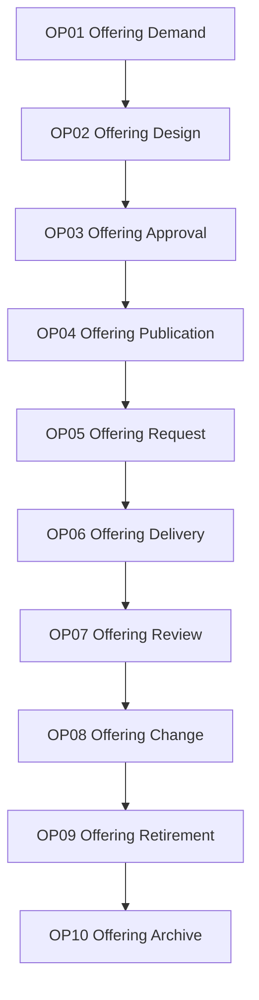

# Offering Lifecycle Control Framework

Version: 1.0  
Status: Proposed Baseline  
Architecture: Rimba Team Operating System


## Purpose

This document governs the complete Offering lifecycle within TOS while preserving existing Rimba package boundaries.

## Owning Implementation

```text
rimba/tos
```

## Rimba Alignment

- Core models: `Offering`, `OfferingRequest`.
- Versioning: reuse polymorphic `Version`; do not create `OfferingVersion`.
- Delivery automation: `Offering.workflow_blueprint_id` references `WorkflowBlueprint`.
- Demand execution: `OfferingRequest` may be the trackable record of a `WorkflowInstance`.
- Team governance: use `TeamOffering`.

## Framework Hierarchy

```text
Lifecycle
  ↓
Lifecycle Package
  ↓
WorkflowBlueprint
  ↓
WorkflowNode
  ↓
WorkPackage
  ↓
Checklist
  ↓
Task
```

A lifecycle package is governance. Runtime orchestration remains in `rimba/jalan`, while executable work remains in `rimba/kerja`.

## Lifecycle Overview



## Lifecycle Packages

### OP01 Offering Demand

**Input:** Recognized need  
**Output:** Approved offering demand

### OP02 Offering Design

**Input:** Approved offering demand  
**Output:** Offering definition

### OP03 Offering Approval

**Input:** Offering definition  
**Output:** Approved Offering

### OP04 Offering Publication

**Input:** Approved Offering  
**Output:** Available Offering

### OP05 Offering Request

**Input:** Available Offering  
**Output:** OfferingRequest

### OP06 Offering Delivery

**Input:** OfferingRequest  
**Output:** Fulfilled OfferingRequest

### OP07 Offering Review

**Input:** Delivery evidence  
**Output:** Offering review

### OP08 Offering Change

**Input:** Approved change  
**Output:** New Version

### OP09 Offering Retirement

**Input:** Retirement decision  
**Output:** Retired Offering

### OP10 Offering Archive

**Input:** Retired Offering  
**Output:** Archived lifecycle record

## Governance Rules

1. Every Offering lifecycle workflow shall map to exactly one lifecycle package.
2. Existing package-owned models shall be reused rather than duplicated in `rimba/tos`.
3. Every lifecycle transition shall preserve status, effective date, actor, source and evidence where applicable.
4. Version history shall use `rimba/versi` when content versioning is required.
5. Flexible metadata shall use the established `attributes` strategy or `rimba/sifat`.
6. Audit evidence shall use package events and `rimba/jejak`.
7. Team relationships shall be explicit when ownership, operation, allocation or audience can change over time.
8. Retirement shall close active relationships and stop new activity; it shall not erase history.
9. Cross-domain triggers shall reference the originating model through explicit keys or polymorphic triggerable relationships.
10. No implementation shall begin without an approved lifecycle package mapping.

## TOS Relationship

```text
Resource performs Workflow
Workflow delivers Offering
Supply enables Workflow
Knowledge guides Workflow
OrgTeam governs the relationships
```

## End of Control Framework
