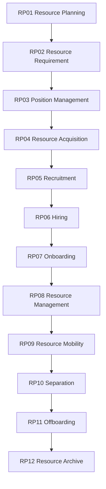

# Resource Lifecycle Control Framework

Version: 1.0  
Status: Proposed Baseline  
Architecture: Rimba Team Operating System


## Purpose

This document governs the complete Resource lifecycle within TOS while preserving existing Rimba package boundaries.

## Owning Implementation

```text
rimba/wfm + rimba/orang + rimba/jawat + rimba/janji
```

## Rimba Alignment

- Keep `Staff`, `JobPosition`, `Agreement`, `WorkforceAssignment`, and `WorkforceEvent` independent.
- `WorkforceAssignment` is the authoritative effective-dated resource placement.
- Every assignment change is represented by closing/replacing assignments and recording a `WorkforceEvent`.
- Do not create a generic `Resource` model that duplicates `Staff`.
- Team governance: use `TeamResource` only for additional allocation or cross-team participation.

## Framework Hierarchy

```text
Lifecycle
  ↓
Lifecycle Package
  ↓
WorkflowBlueprint
  ↓
WorkflowNode
  ↓
WorkPackage
  ↓
Checklist
  ↓
Task
```

A lifecycle package is governance. Runtime orchestration remains in `rimba/jalan`, while executable work remains in `rimba/kerja`.

## Lifecycle Overview



## Lifecycle Packages

### RP01 Resource Planning

**Input:** Organizational demand  
**Output:** WorkforcePlan

### RP02 Resource Requirement

**Input:** Approved WorkforcePlan  
**Output:** WorkforceRequirement

### RP03 Position Management

**Input:** Approved requirement  
**Output:** JobPosition

### RP04 Resource Acquisition

**Input:** Position demand  
**Output:** ManpowerRequest

### RP05 Recruitment

**Input:** Approved ManpowerRequest  
**Output:** Candidate shortlist

### RP06 Hiring

**Input:** Selected candidate  
**Output:** Agreement

### RP07 Onboarding

**Input:** Effective Agreement  
**Output:** Staff and WorkforceAssignment

### RP08 Resource Management

**Input:** Active assignment  
**Output:** Workforce events and lifecycle records

### RP09 Resource Mobility

**Input:** Approved change  
**Output:** Replacement WorkforceAssignment

### RP10 Separation

**Input:** Separation trigger  
**Output:** Approved separation

### RP11 Offboarding

**Input:** Approved separation  
**Output:** Closed engagement

### RP12 Resource Archive

**Input:** Closed engagement  
**Output:** EmploymentArchive

## Governance Rules

1. Every Resource lifecycle workflow shall map to exactly one lifecycle package.
2. Existing package-owned models shall be reused rather than duplicated in `rimba/tos`.
3. Every lifecycle transition shall preserve status, effective date, actor, source and evidence where applicable.
4. Version history shall use `rimba/versi` when content versioning is required.
5. Flexible metadata shall use the established `attributes` strategy or `rimba/sifat`.
6. Audit evidence shall use package events and `rimba/jejak`.
7. Team relationships shall be explicit when ownership, operation, allocation or audience can change over time.
8. Retirement shall close active relationships and stop new activity; it shall not erase history.
9. Cross-domain triggers shall reference the originating model through explicit keys or polymorphic triggerable relationships.
10. No implementation shall begin without an approved lifecycle package mapping.

## TOS Relationship

```text
Resource performs Workflow
Workflow delivers Offering
Supply enables Workflow
Knowledge guides Workflow
OrgTeam governs the relationships
```

## End of Control Framework
