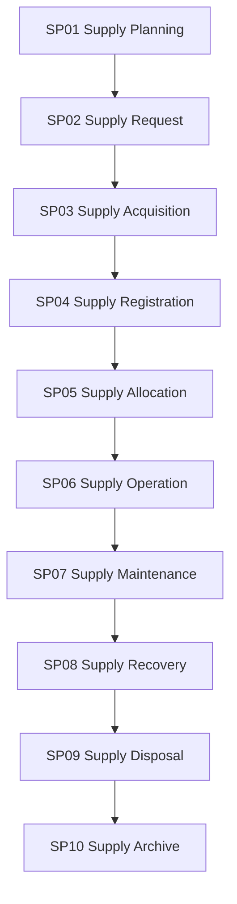

# Supply Lifecycle Control Framework

Version: 1.0  
Status: Proposed Baseline  
Architecture: Rimba Team Operating System


## Purpose

This document governs the complete Supply lifecycle within TOS while preserving existing Rimba package boundaries.

## Owning Implementation

```text
rimba/eam
```

## Rimba Alignment

- Add only `Supply`, `SupplyAssignment`, and `SupplyEvent` to `rimba/eam` for MVP.
- Use `type` classification rather than separate Asset, Equipment, License, Facility, or Material models.
- Use polymorphic `assignable` on `SupplyAssignment`.
- Use `ThingAttribute` or the existing `attributes` JSON strategy for specialized properties.
- Team governance: use `TeamSupply`.

## Framework Hierarchy

```text
Lifecycle
  ↓
Lifecycle Package
  ↓
WorkflowBlueprint
  ↓
WorkflowNode
  ↓
WorkPackage
  ↓
Checklist
  ↓
Task
```

A lifecycle package is governance. Runtime orchestration remains in `rimba/jalan`, while executable work remains in `rimba/kerja`.

## Lifecycle Overview



## Lifecycle Packages

### SP01 Supply Planning

**Input:** Demand forecast  
**Output:** Approved supply plan

### SP02 Supply Request

**Input:** Approved supply plan  
**Output:** Approved acquisition request

### SP03 Supply Acquisition

**Input:** Approved request  
**Output:** Acquired Supply

### SP04 Supply Registration

**Input:** Acquired Supply  
**Output:** Registered Supply

### SP05 Supply Allocation

**Input:** Available Supply  
**Output:** SupplyAssignment

### SP06 Supply Operation

**Input:** Active assignment  
**Output:** Usage state

### SP07 Supply Maintenance

**Input:** Maintenance trigger  
**Output:** Maintained Supply

### SP08 Supply Recovery

**Input:** Return trigger  
**Output:** Recovered Supply

### SP09 Supply Disposal

**Input:** Approved retirement  
**Output:** Disposed Supply

### SP10 Supply Archive

**Input:** Disposed Supply  
**Output:** Archived lifecycle record

## Governance Rules

1. Every Supply lifecycle workflow shall map to exactly one lifecycle package.
2. Existing package-owned models shall be reused rather than duplicated in `rimba/tos`.
3. Every lifecycle transition shall preserve status, effective date, actor, source and evidence where applicable.
4. Version history shall use `rimba/versi` when content versioning is required.
5. Flexible metadata shall use the established `attributes` strategy or `rimba/sifat`.
6. Audit evidence shall use package events and `rimba/jejak`.
7. Team relationships shall be explicit when ownership, operation, allocation or audience can change over time.
8. Retirement shall close active relationships and stop new activity; it shall not erase history.
9. Cross-domain triggers shall reference the originating model through explicit keys or polymorphic triggerable relationships.
10. No implementation shall begin without an approved lifecycle package mapping.

## TOS Relationship

```text
Resource performs Workflow
Workflow delivers Offering
Supply enables Workflow
Knowledge guides Workflow
OrgTeam governs the relationships
```

## End of Control Framework
