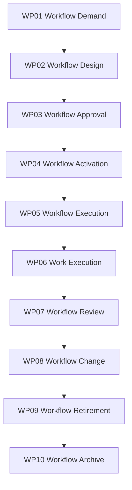

# Workflow Lifecycle Control Framework

Version: 1.0  
Status: Proposed Baseline  
Architecture: Rimba Team Operating System


## Purpose

This document governs the complete Workflow lifecycle within TOS while preserving existing Rimba package boundaries.

## Owning Implementation

```text
rimba/jalan + rimba/kerja
```

## Rimba Alignment

- Definition and orchestration: reuse `WorkflowBlueprint`, `WorkflowNode`, and `WorkflowTransition`.
- Runtime: reuse workflow instance models.
- Work content: reuse `WorkPackage`, `Checklist`, `Task`, and their instance models.
- Do not create generic `Workflow`, `WorkflowVersion`, or duplicate task models in `rimba/tos`.
- Team governance: use `TeamWorkflow`.

## Framework Hierarchy

```text
Lifecycle
  ↓
Lifecycle Package
  ↓
WorkflowBlueprint
  ↓
WorkflowNode
  ↓
WorkPackage
  ↓
Checklist
  ↓
Task
```

A lifecycle package is governance. Runtime orchestration remains in `rimba/jalan`, while executable work remains in `rimba/kerja`.

## Lifecycle Overview



## Lifecycle Packages

### WP01 Workflow Demand

**Input:** Recognized work need  
**Output:** Approved workflow demand

### WP02 Workflow Design

**Input:** Approved workflow demand  
**Output:** WorkflowBlueprint graph

### WP03 Workflow Approval

**Input:** WorkflowBlueprint graph  
**Output:** Approved blueprint

### WP04 Workflow Activation

**Input:** Approved blueprint  
**Output:** Active WorkflowBlueprint

### WP05 Workflow Execution

**Input:** Active WorkflowBlueprint  
**Output:** WorkflowInstance

### WP06 Work Execution

**Input:** Active node  
**Output:** WorkPackageInstance and task evidence

### WP07 Workflow Review

**Input:** Execution evidence  
**Output:** Workflow review

### WP08 Workflow Change

**Input:** Approved change  
**Output:** Revised blueprint/version

### WP09 Workflow Retirement

**Input:** Retirement decision  
**Output:** Inactive blueprint

### WP10 Workflow Archive

**Input:** Inactive blueprint  
**Output:** Archived lifecycle record

## Governance Rules

1. Every Workflow lifecycle workflow shall map to exactly one lifecycle package.
2. Existing package-owned models shall be reused rather than duplicated in `rimba/tos`.
3. Every lifecycle transition shall preserve status, effective date, actor, source and evidence where applicable.
4. Version history shall use `rimba/versi` when content versioning is required.
5. Flexible metadata shall use the established `attributes` strategy or `rimba/sifat`.
6. Audit evidence shall use package events and `rimba/jejak`.
7. Team relationships shall be explicit when ownership, operation, allocation or audience can change over time.
8. Retirement shall close active relationships and stop new activity; it shall not erase history.
9. Cross-domain triggers shall reference the originating model through explicit keys or polymorphic triggerable relationships.
10. No implementation shall begin without an approved lifecycle package mapping.

## TOS Relationship

```text
Resource performs Workflow
Workflow delivers Offering
Supply enables Workflow
Knowledge guides Workflow
OrgTeam governs the relationships
```

## End of Control Framework
